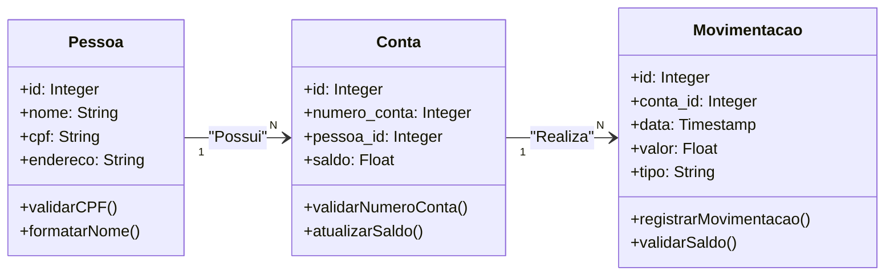

# Back-End do Teste Técnico

O back-end do sistema **MyBank** é uma API RESTful desenvolvida para gerenciar usuários, contas bancárias e suas movimentações financeiras. Ele foi projetado para interagir com um front-end que realiza operações como depósitos, retiradas e consulta de extratos de contas bancárias.

---

## 📋 Funcionalidades

- **Gerenciamento de Usuários**:
    - Cadastro, listagem, edição, deleção e consulta de informações de usuários.
    - Busca de usuários pelo ID, nome e CPF.

- **Gerenciamento de Contas**:
    - Cadastro e listagem de contas associadas a um usuário.
    - Consulta de informações de contas, incluindo saldo.

- **Movimentações Bancárias**:
    - Realização de depósitos e retiradas.
    - Validação de saldo disponível para retiradas.
    - Registro histórico de movimentações (extrato).

---

## 🚀 Tecnologias Utilizadas

- **Java**: Linguagem principal do projeto.
- **Spring Boot**: Framework usado para construção da aplicação.
- **Spring Data JPA**: Para mapeamento e gerenciamento do banco de dados.
- **PostgreSQL**: Banco de dados relacional utilizado para armazenar as informações do sistema.
- **Maven**: Gerenciador de dependências e build.
- **Postman**: Para testes da API.

---

## 📂 Estrutura do Projeto

Abaixo está a organização do diretório `src/main/java`:

```
com.bank
├── config
│   └── CorsConfig.java                     # Configuração de CORS
├── controller                              # Controladores REST
│   ├── ContaController.java                # Controlador para contas bancárias
│   ├── MovimentacaoController.java         # Controlador para movimentações
│   └── PessoaController.java               # Controlador para usuários
├── DTO                                     # Data Transfer Objects
│   ├── ContaDTO.java                       # DTO para contas
│   ├── NewPessoaDTO.java                   # DTO para cadastro de novas pessoas
│   ├── PessoaDTO.java                      # DTO para usuários
│   └── PessoaSemEnderecoDTO.java           # DTO para usuários sem endereço
├── handler
│   └── GlobalExceptionHandler.java         # Handler global para exceções
├── model                                   # Modelos JPA
│   ├── enums
│   │   └── TipoMovimentacao.java           # Enum para tipos de movimentação (DEPÓSITO, RETIRADA)
│   ├── Conta.java                          # Entidade Conta
│   ├── Movimentacao.java                   # Entidade Movimentação
│   └── Pessoa.java                         # Entidade Pessoa
├── repository                              # Repositórios JPA
│   ├── ContaRepository.java                # Repositório para contas
│   ├── MovimentacaoRepository.java         # Repositório para movimentações
│   └── PessoaRepository.java               # Repositório para usuários
├── service                                 # Serviços de negócios
│   ├── ContaService.java                   # Lógica de negócio para contas
│   ├── MovimentacaoService.java            # Lógica de negócio para movimentações
│   └── PessoaService.java                  # Lógica de negócio para usuários
└── MybankAppApplication.java               # Classe principal da aplicação
```

---

## 🛠️ Pré-requisitos

Certifique-se de ter instalado em sua máquina:
- **Java 11** ou superior
- **Maven** (Gerenciador de dependências)
- **PostgreSQL** (Banco de dados relacional)
- **Postman** (ou outra ferramenta para testes de API)

---

## ⚙️ Configuração do Projeto

1. Clone o repositório:
   ```bash
   git clone https://github.com/SENAI-SD/prova-java-junior-00933-2025-364.850.238-79.git
   ```

2. Navegue até o diretório do projeto:
   ```bash
   cd bank-app
   ```

3. Configure o banco de dados PostgreSQL:
    - Crie um banco de dados chamado `mybank-app` no PostgreSQL:
      ```sql
      CREATE DATABASE mybank-app;
      ```
    - Atualize as credenciais no arquivo `src/main/resources/application.properties`:
      ```
      spring.datasource.url=jdbc:postgresql://localhost:5432/mybankdb
      spring.datasource.username=seu-usuario
      spring.datasource.password=sua-senha
      spring.jpa.hibernate.ddl-auto=update
      spring.jpa.properties.hibernate.dialect=org.hibernate.dialect.PostgreSQLDialect
      ```

4. Compile e execute o projeto:
   ```bash
   mvn spring-boot:run
   ```

5. Acesse o sistema no navegador ou Postman:
   ```
   http://localhost:8080
   ```

---

## 🔄 Relação Entre as Entidades

O sistema é baseado nas seguintes entidades e suas relações:



---

## 🔄 Endpoints da API

## 🔹 Pessoas

### `GET /pessoas`
- **Descrição:** Lista ID, nome, CPF e endereço de todos os clientes.
- **Resposta esperada:** `200 OK`

### `GET /pessoas/IdNomeCpf`
- **Descrição:** Lista ID, nome e CPF de todos os clientes.
- **Resposta esperada:** `200 OK`

### `POST /pessoas/{id}`
- **Descrição:** Cadastra um cliente.
- **Body JSON:**
```json
{
  "nome": "João Silva"
}
```

### `PUT /pessoas/{id}`
- **Descrição:** Edita um cliente.
- **Body JSON:**
```json
{
  "nome": "João Silva"
}
```

### `DELETE /clientes/`
- **Descrição:** Exclui um cliente.
- **Resposta esperada:** `200 OK`

---

## 🔹 Contas

### `GET /empresas`
- **Descrição:** Lista ID, número da conta e saldo de todos os clientes.

### `GET /pessoas/IdNomeCpf`
- **Descrição:** Lista ID, nome, CPF e conta de todos os clientes.

### `POST /contas/cadastro?pessoa_id={id}`
- **Descrição:** Cadastra uma conta para o cliente de ID 3.
- **Body JSON:**
```json
{
  "numeroConta": "981276027"
}
```

### `PUT /contas/{id}`
- **Descrição:** Atualiza a conta de ID 2.
- **Body JSON:**
```json
{
  "numeroConta": "981276027"
}
```

### `DELETE /empresas/`
- **Descrição:** Exclui uma conta.

---

## 🔹 Movimentações

### `POST /movimentacoes/cadastro` (Depósito)
- **Descrição:** Realiza um depósito.
- **Body JSON:**
```json
{
  "conta": { "id": 4 },
  "valor": 100.00,
  "tipo": "DEPOSITO"
}
```

### `POST /movimentacoes/cadastro` (Saque)
- **Descrição:** Realiza um saque.
- **Body JSON:**
```json
{
  "conta": { "id": 4 },
  "valor": 100.00,
  "tipo": "RETIRADA"
}
```

### `GET /movimentacoes/conta/{contaId}`
- **Descrição:** Lista movimentações por conta.

---

### Movimentações
- **GET /movimentacoes/conta/{contaId}**:  
  Lista todas as movimentações de uma conta (extrato).  
  **Exemplo de Resposta**:
  ```json
  [
    {
      "id": 1,
      "valor": 100.00,
      "tipo": "DEPOSITO",
      "data": "2025-04-19T14:33:08.440255",
      "conta": {
        "id": 1,
        "numeroConta": "12345678910",
        "saldo": 500.00
      }
    }
  ]
  ```

- **POST /movimentacoes/cadastro**:  
  Realiza uma movimentação (depósito ou retirada).  
  **Exemplo de Requisição**:
  ```json
  {
    "conta": {
      "id": 1
    },
    "valor": 100.00,
    "tipo": "DEPOSITO"
  }
  ```

---

## 🤝 Contribuindo

Contribuições são bem-vindas! Para contribuir:
1. Faça um fork do projeto.
2. Crie uma branch com sua feature:
   ```bash
   git checkout -b minha-feature
   ```
3. Faça commit das suas alterações:
   ```bash
   git commit -m "Adiciona nova funcionalidade"
   ```
4. Envie para o repositório remoto:
   ```bash
   git push origin minha-feature
   ```
5. Abra um Pull Request.

---

## 📝 Nota

Nem tudo está perfeito, mas tudo foi feito com cuidado e dedicação. Obrigado!

---

Feito com 💙 por [jveiiga](https://github.com/seu-usuario).